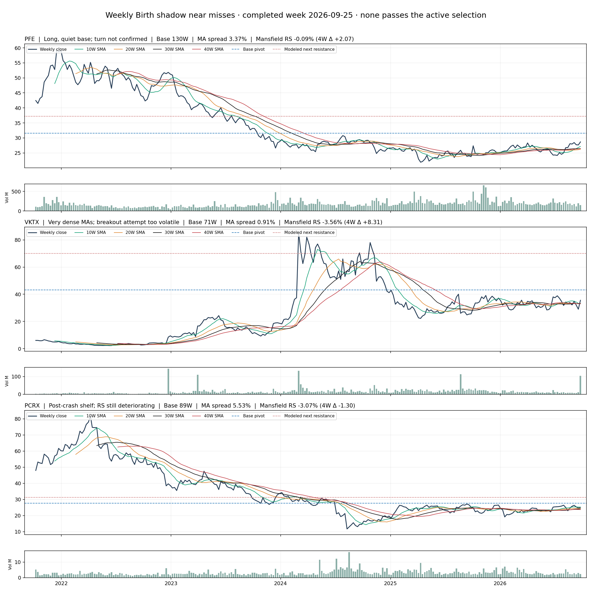

# Early Base Watch — 2026-09-25 shadow review

The exact activated Unified manifest (`8148312d9bf9953acf26e4ec7120f2df9e32b0ae7114355846b6681d269002a4`) contained 2,664 evaluated names and no confirmed Weekly Birth selection. This is a separate **research-only** view of Bottom Crash Base near misses. The user said PFE, VKTX and PCRX looked closer to the intended early-weekly style than the prior examples, but did not approve them as signals.

| Name | Why it is worth a chart review | Why it is still excluded |
| --- | --- | --- |
| PFE | 130-week base, 3.37% MA spread, 7.78% recent 12-week close range; Mansfield RS improved 2.07 points in four weeks. The modeled next swing is 17.91% beyond the $31.54 base pivot. | The 30W turn check is not met, and the eight-week rise is 14.63%; current close $28.67 has not reached the pivot. Last-week volume was 0.94× the prior four-week average. |
| VKTX | 71-week post-crash base and exceptionally dense MAs (0.91% spread); Mansfield RS improved 8.31 points. | RS is still -3.56%, the recent 12-week range is 26.79%, and the latest week spanned $28.41–$43.10 before closing at $35.56. The 11.1× volume spike does not by itself confirm a clean breakout. |
| PCRX | 89-week base after a prolonged decline, 5.53% MA spread and 13.13% modeled runway beyond the $27.64 pivot. | Mansfield RS is -3.07% and fell 1.30 points over four weeks; the recent shelf is not yet tight enough (15.45% range), and the 30W turn check fails. |

The new Early Base Watch requires a triggered Bottom Crash Base, at least 52 weeks of measured base, no mature 30W advance before the base, a flat prior 13-week 30W trend, MA spread at most 8%, a price within 20% below to 4% above the pivot, measured overhead room, and bounded extension. It allows a wider current shelf and mildly weak RS only for **review**, then orders the names by the tightness of their recent range. It is capped at five and can be empty. Rejection reasons remain visible. The Weekly Birth selection and Telegram payload never read this research-only list.

This is a point-in-time visual and numeric review, not prospective validation. The volume and modeled Mansfield readings have not been independently compared with the owner's TradingView layout for every candidate. A first-session shadow result, five prospective sessions, and the owner's chart judgment remain the promotion gate.

The subsequent [A–D shadow tier hypothesis](WEEKLY_BIRTH_TIERS_SHADOW.md) expands C to non-Crash Bottom members and adds a separate D research queue. The Crash-only rule above describes the original 2026-09-25 watch implementation.
